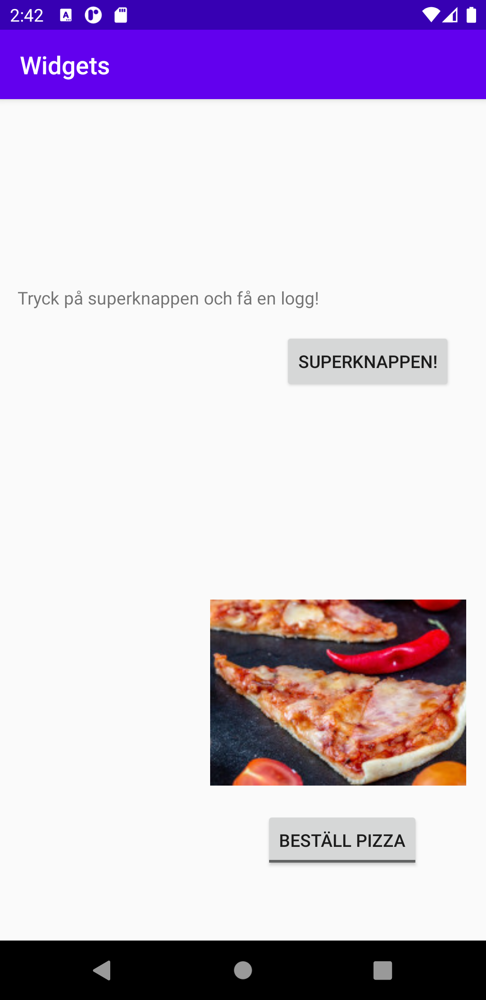

# Rapport
---------------------------------------------------------------------------------------------------------------------------------------
För att lösa uppgiften påbörjades några expriment där kod lades till i XML-filen för att skapa en knapp.
Då knappen var skapad fortsattes experimentet i MainActivity.java där koden lades till för att skriva ut en text till loggen.
Koden till knappen är initialt helt handknackad för att sedan gå över till designläget i XML-filen och grafiskt förflytta knappen istället
för att skriva in kod för positionen. Mycket smidigt!
I MainActivity.java skapas en variabel som tilldelas knappens id. Denna variabel används sedan tillsammans med en onClickListener som
känner av om knappen blir klickad på. I funktionen (eller metoden när det är objektorienterat?) setOnClickListener(); stoppas den tidigare
nämnda funktionen onClickListener vilket kommer leda oss in på att Log.d. Det är koden som gör att texten Knappen är klickad... skrivs ut
till loggen.
Se kod 1.
---------------------------------------------------------------------------------------------------------------------------------------
Elementen imageView och toggleButton har lagts till genom designläget vilket var mycket smidigt! Dessa har dessutom helt enkelt bara högerklickats
på dessutom för att få en constrain-layout. Textelementet är det element som låg med appen från början och har helt enkelt bara fått en ny text och
en constrain-layout för att kunna positioneras.
Se exempel kod 2.
-----------------

```
Kod 1:
I XML:
<Button
        android:id="@+id/knappensid"
        android:layout_width="wrap_content"
        android:layout_height="wrap_content"
        android:text="Superknappen!"
        app:layout_constraintBottom_toBottomOf="parent"
        app:layout_constraintHorizontal_bias="0.894"
        app:layout_constraintLeft_toLeftOf="parent"
        app:layout_constraintRight_toRightOf="parent"
        app:layout_constraintTop_toTopOf="parent"
        app:layout_constraintVertical_bias="0.297" />
I java:
        Button variabelKnappen = findViewById(R.id.knappensid);     //Notera nästan ALLT har en egen datatyp.

        variabelKnappen.setOnClickListener(new View.OnClickListener() {
            @Override
            public void onClick(View view) {
                Log.d("==>","Knappen är klickad! Tjohoooooooo!");
            }
        });
```

```
Kod 2:
<ImageView
        android:id="@+id/imageView2"
        android:layout_width="wrap_content"
        android:layout_height="wrap_content"
        android:layout_marginTop="404dp"
        android:layout_marginEnd="16dp"
        android:layout_marginRight="16dp"
        app:layout_constraintEnd_toEndOf="parent"
        app:layout_constraintTop_toTopOf="parent"
        app:srcCompat="@drawable/pizza_bild_till_app" />
```




